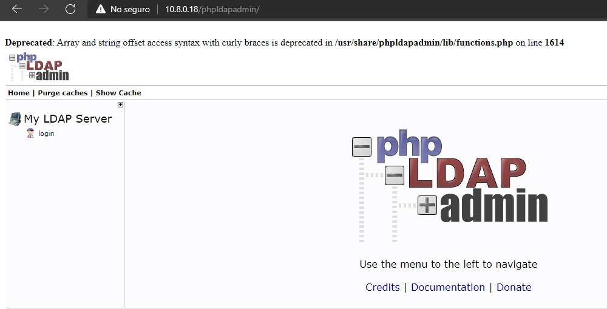
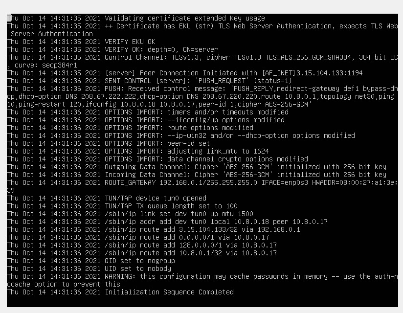
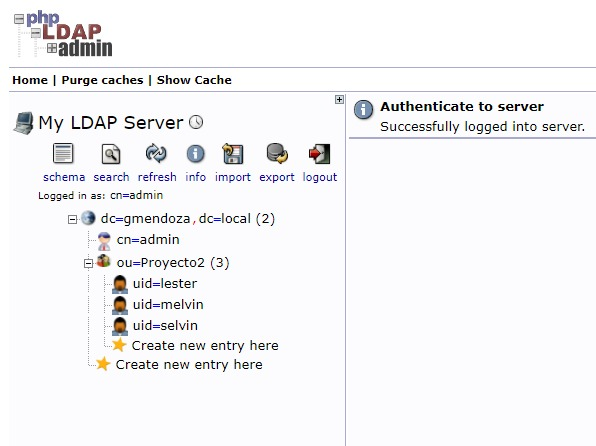
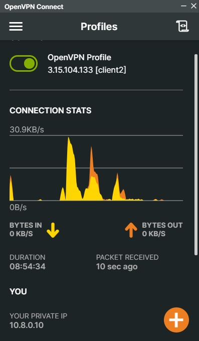

<!--Como configurar una VPN--> 

# Universidad Mariano Gálvez
## Carrera: Ingeniera en Sistemas de Información
## Cátedra: Seguridad y Auditoria de Sistemas
## Catedratico: Ingeniero Melvin Calí
## Sede: Boca del Monte 
## Fecha: 15-10-21

## Miembros del Grupo:
1. Gary Lester Mendoza Bedoya
     * 7690-17-14228
2. Selvin Omar Castellanos Solares               
    * 7690-17-14269
3. Rogelio Alfonso Alvarez Girón
    * 7690-98-2290

_____________________
_____________________
# Proyecto II ----- Configuración Intranet -----

# Introducción

El presente Proyecto tiene como objetio la configuración de una INTRANET, para lo cual es necesario hacer uso de los conocimientos adquiridos durantes los cursos pasados de la carrera, para poder lograr cumplir con la especificaciones presentandas por el catedrático títula de la clase.

Para realizar este Proyecto se tuvo que trabajar configurando una serie de pasos para lograr cumplir con el objetivo, dentro de estos pasos podríamos mencionar la configuración de  DHCP, DNS, VPN, VPC, Directorio Activo, etc.

## Definición Técnica de Intranet

La intranet es la plataforma virtual que una empresa o entidad pone a disposición de quienes pertenecen a ella, particularmente, sus empleados.

Es decir, la intranet es una red interna que permite que los trabajadores de una compañía puedan estar en contacto entre ellos, y con la gerencia de la organización.
El objetivo de una intranet es que la empresa pueda facilitar ciertos procesos internos, habilitándolos de forma digital, valiéndose de Internet.

Funciones de la intranet
Las principales funciones de la intranet son las siguientes:

* Permitir el intercambio de información entre los diferentes departamentos de la empresa.
* Poner a disposición de los empleados los recursos que necesitan para realizar las tareas encargadas.
* Trabajar con un sistema de información centralizada que permite a la empresa monitorear todos sus procesos.
* Facilitar a los empleados la realización de distintos trámites, como el registro de vacaciones o la solicitud de algún documento corporativo.
* Permite interactuar a dos empleados que están involucrados en el mismo proyecto o tarea, aunque se encuentren físicamente distanciados. Por ejemplo, puede ser que cada uno trabaje en una ciudad diferente.

  * Intranet:

## Configuración Servidor OpenLDAP con Samba en Ubuntu

En este pequeño manual vamos a ver cómo se instala OpenLDAP en un equipo con el sistema operativo Ubuntu LTS. También supondremos que el sistema dispone del sistema de archivos NFS debidamente instalado y configurado para exportar la carpeta /home.

Para llevar a cabo nuestro cometido, realizaremos las siguientes tareas:

1. Instalar los paquetes necesarios.
2. Realizar la configuración básica de OpenLDAP
3. Configurar la autenticación para los clientes
4. Crear la estructura del directorio
5. Añadir un usuario y un grupo
6. Comprobar que todo es correcto

A continuación aprenderemos como se  configuran los equipos cliente para autenticarse con LDAP.

## Instalar OpenLDAP en el servidor
El proceso de instalación es realmente sencillo. Básicamente consiste en instalar el paquete slapd, aunque nosotros también instalaremos el paquete que contiene las utilidades de administración de LDAP: ldap-utils.

Como ambos paquetes se encuentran en los repositorios oficiales de Ubuntu, sólo tenemos que escribir en la terminal la siguiente orden:

   * sudo apt-get install slapd ldap-utils

 1. Como de costumbre, el sistema nos solicita la contraseña de administración.

 2. Cuando terminemos de escribir, pulsaremos la tecla Intro.
 3. Poco después, el proceso de instalación habrá terminado.

 ## Realizamos la configuración básica de OpenLDAP

 * Imagen de la conexión que realizamos al Servidor OpenLDap
 

## Especificaciones de configuración
 Comenzaremos por modificar el contenido del archivo /etc/hosts. El objetivo es que, cuando hagamos referencia a los nombres ldapserver o ldapserver.somebooks.local, nuestro sistema entienda que nos estamos refiriendo al servidor (quizás sería oportuno cambiar también el nombre del servidor, como hicimos en el capítulo 10: Instalar y configurar NFS en Ubuntu, pero, por el momento, no resulta imprescindible).

 1. Abrimos el archivo /etc/hosts usando el editor nano.

 * Dentro del archivo, añadimos una nueva línea que relacione la dirección IP estática del servidor con los nombres lógicos que tenemos previsto utilizar.

 2. Cuando acabemos, pulsamos Ctrl + x para salir y nos 
 aseguramos de guardar los cambios en el archivo.

 * A continuación, instalaremos la librería NSS para LDAP. Esta librería ofrece una interfaz para acceder y configurar distintas bases de datos utilizadas para almacenar cuentas de usuario (entre otras, /etc/passwd, /etc/group, /etc/hosts, LDAP, etc.).

 3. Instalamos el paquete con privilegios de superusuario.

 * Una de las dependencias del paquete libnss-ldap es el paquete de configuración de la autenticación de LDAP (ldap-auth-config). Durante su instalación se iniciará un asistente que nos irá solicitando la información que necesita para su correcta configuración.

* En el primar paso, nos solicita la dirección URi del servidor LDAP. Es importante dejar el principio tal y como lo encontramos (ldapi:///).

 4. Cuando completemos la dirección IP, pulsaremos la tecla Intro. 

* A continuación escribiremos el nombre global único (Distinguished Name – DN) siguiendo las indicaciones que vimos al principio de este capítulo (dc=somebooks,dc=local)

5. Cuando acabemos, volvemos a pulsar la tecla Intro.
* En el siguiente paso, indicaremos la versión del protocolo LDAP que vamos a utilizar. Salvo que dispongamos en nuestra red de clientes muy antiguos, lo normal será elegir el valor más alto.

6. Cuando acabemos, pulsamos de nuevo la tecla Intro.
* A continuación, indicaremos si las utilidades que utilicen PAM deberán comportarse del mismo modo que cuando cambiamos contraseñas locales. Esto hará que las contraseñas se guarden en un archivo independiente que sólo podrá ser leído por el superusuario.

7. Elegimos la opción Yes y pulsamos la tecla Intro.
* A continuación, el sistema nos pregunta si queremos que sea necesario identificarse para realizar consultas en la base de datos de LDAP.

8. Elegimos la opción No y volvemos a pulsar la tecla Intro.
* Ya sólo nos queda indicar el nombre de la cuenta LDAP que tendrá privilegios para realizar cambios en las contraseñas. Como antes, deberemos escribir un nombre global único (Distinguished Name – DN) siguiendo las indicaciones que vimos al principio de este capítulo (cn=admin,dc=somebooks,dc=local)

9. Después de escribir el nombre adecuado, pulsaremos la tecla Intro.
* En el último paso, el asistente nos solicita la contraseña que usará la cuenta anterior (como siempre, habrá que escribirla por duplicado para evitar errores tipográficos). Deberá coincidir con la que escribimos en el apartado Instalar OpenLDAP en el servidor.

10. Cuando terminemos de escribir la contraseña, pulsaremos la tecla Intro.
* De vuelta en la pantalla de la terminal, podremos comprobar que no ha habido errores durante el proceso.

11. Con esto habremos terminado la configuración básica de LDAP.

## Configurar la autenticación para los clientes

Lo primero que haremos será utilizar auth-client-config, un script que nos ayuda a modificar los archivos de configuración de PAM y NSS. Para conseguirlo, ejecutamos el siguiente comando en la terminal:

* sudo auth-client-config -t nss -p lac_ldap

Como puede verse, en nuestro caso hemos utilizado dos atributos:

* -t nss, con el que le indicamos que los archivos que vamos a modificar son los correspondientes a NSS

* -p lac_ldap, con el que indicamos que los datos para la configuración debe tomarlos del archivo lac_ldap. Este archivo se habrá generado durante la ejecución de ldap-auth-config en el punto anterior.

1. Ejecutamos el comando en la terminal.
* La ejecución de este comando no debe ofrecer ningún tipo de error. De lo contrario, deberíamos repasar la configuración ejecutando de nuevo ldap-auth-config.
A continuación, deberemos actualizar la configuración de las políticas de autenticación predeterminadas de PAM, lo que conseguimos con el siguiente comando:

   * sudo pam-auth-update
2. Escribimos el comando y pulsamos Intro.

* Al ejecutarlo, aparecerá un asistente, que nos muestra una primera pantalla informativa sobre la función de los módulos PAM.

3. Para continuar, pulsamos la tecla Intro.
* En la siguiente pantalla, elegiremos cuáles de los módulos disponibles queremos habilitar. De forma predeterminada aparecen todos marcados…

4. … Por lo tanto, nos limitamos a volver a pulsar la tecla Intro para volver a la terminal

* Una vez acabada la configuración automática, podremos hacer algunos cambios complementarios editando el archivo /etc/ldap.conf. Para lograrlo, recurriremos, como siempre, al editor nano:

   * sudo nano /etc/ldap.conf

* Una vez que se abra el editor, podremos ajustar algunos de los valores del documento, pero, sobre todo, comprobaremos que son correctos los siguientes datos:

  * host 192.168.1.10 base 
dc=somebooks,dc=local 
uri ldapi://192.168.1.10/ 
rootbinddn cn=admin,dc=somebooks,dc=local 
ldap_version 3
bind_policy soft

5. Sólo nos quedará pulsar Ctrl + x para salir y asegurarnos de guardar los cambios en el archivo.

* Con esto habremos terminado la configuración del servidor LDAP. Ahora está listo para autenticar usuarios. Sin embargo, aún nos queda establecer el comportamiento del demonio SLAPD.

## Creamos la estructura del directorio

* Imagen que muestra el Directorio Activo corriendo

Una vez configurado el servidor, deberemos configurar la estructura básica del directorio. Es decir, crearemos la estructura jerárquica del árbol (DIT – Directory Information Tree).
Una de las formas más sencillas de añadir información al directorio es utilizar archivos LDIF (LDAP Data Interchange Format). En realidad, se trata de archivos en texto plano, pero con un formato particular que debemos conocer poder construirlos correctamente

1. Aquí lo hemos llamado base.ldif, pero, lógicamente, podrás llamarlo como te resulte más apropiado.

* Lógicamente, en cada lugar donde aparecen los valores dc=somebooks,dc=local deberemos sustituirlos por los valores correctos en cada implementación.

2. Cuando hayamos terminado de escribirlo, sólo nos quedará pulsar Ctrl + x para salir y asegurarnos de guardar los cambios en el archivo.
* A continuación, deberemos añadir la información a la base de datos OpenLDAP. Como sabemos, esto se hace con el comando ldapadd:
  * sudo ldapadd -x -D cn=admin,dc=somebooks,dc=local -W -f base.ldif

3. Para ejecutar el comando, deberemos escribir la contraseña de administración de LDAP.
* Después, podremos comprobar que los nuevos objetos se han añadido correctamente.

## Añadir un usuario y un grupo

* Para añadir un nuevo usuario, recurriremos, como hasta ahora, al editor nano:
  * sudo nano ~/usuario.ldif

## Imagen de la Unidad Organizacional que configuramos

1. Abrimos el editor de textos indicándole el nombre del archivo que vamos a crear.
* Por supuesto, puedes cambiar el nombre usuario.ldif por el que te resulte más adecuado en tu caso.
2. Cuando hayamos terminado de escribirlo, sólo nos quedará pulsar Ctrl + x para salir y asegurarnos de guardar los cambios en el archivo.

* Con esto ya estamos listos para cargar el nuevo usuario en el directorio. Sólo tenemos que escribir el siguiente comando:

  * sudo ldapadd -x -D cn=admin,dc=somebooks,dc=local -W -f usuario.ldif

3. Después de escribir la contraseña de administración de LDAP, podremos comprobar que el usuario se ha añadido correctamente.

## Añadir un grupo

* Para añadir el grupo, repetimos de nuevo el proceso anterior:

  * sudo nano ~/grupo.ldif

1. Abrimos el editor de textos indicándole el nombre del archivo que queremos crear

2. Cuando esté listo, pulsamos Ctrl + x para salir y nos aseguramos de guardar los cambios en el archivo.
3. Después de escribir la contraseña de administración de LDAP, podremos comprobar que el grupo se ha añadido correctamente.

## Cómo instalar y configurar un servidor de OpenVPN en Ubuntu 

### Imagen mostrando la conexión real a la VPN

   
* Una red privada virtual (VPN), le permite atravesar redes no fiables como si estuviese en una red privada. Le permite acceder a internet de forma segura desde su smartphone o equipo portátil cuando se conecta a una red no fiable, como la WiFi de un hotel o de una cafetería.
Cuando se combina con conexiones HTTPS, esta configuración le permite proteger los inicios de sesión y las operaciones que realiza por medios inalámbricos. Puede evadir censuras y restricciones geográficas, y proteger su ubicación y el tráfico de HTTP no cifrado contra la actividad de las redes no fiables.
OpenVPN es una solución VPN de seguridad en la capa de transporte (TLS) de código abierto y con características completas que aloja muchas configuraciones. En este tutorial, instalará OpenVPN en un servidor Ubuntu 20.04 y, luego, la configurará para que sea accesible desde la máquina de un cliente.

1. Instalar OpenVPN y Easy-RSA
* Lo primero que haremos sera instalar OpenVPN y Easy-RSA. Easy-RSA es una herramienta de gestión de infraestructura de clave pública (PKI) que usará en el servidor de OpenVPN para generar una solicitud de certificado que, luego, verificará y firmará en el servidor CA.

2. Crear una PKI para OpenVPN
* Antes de poder crear la clave y el certificado privados de su servidor de OpenVPN, deberá crear un directorio local de infraestructura de clave pública en su servidor de OpenVPN. Usará este directorio para gestionar las solicitudes de certificado de clientes y del servidor en vez de hacerlas directamente en su servidor CA.
 Para crear un directorio de PKI en su servidor de OpenVPN, deberá completar un archivo llamado vars con algunos valores predeterminados. Primero, usará cd para ingresar al directorio easy-rsa y, luego, creará y editará el archivo vars utilizando nano o el editor de texto que prefiera.

3. Crear una solicitud de certificado de servidor de OpenVPN y una clave privada
* Ahora que su servidor de OpenVPN tiene todos los requisitos previos instalados, el siguiente paso es generar una clave privada y una solicitud de firma de certificados (CSR) en su servidor de OpenVPN. A continuación, transferirá la solicitud a su CA para que se firme, lo que creará el certificado requerido. Cuando tenga un certificado firmado, lo transferirá de vuelta al servidor de OpenVPN y lo instalará para que el servidor lo use.

4. Firmar la solicitud de certificado del servidor de OpenVPN
* En el paso anterior, creó una solicitud de firma de certificado (CSR) y una clave privada para el servidor de OpenVPN. Ahora el servidor de CA necesita conocer el certificado server y validarlo. Una vez que el CA valide y devuelva el certificado al servidor de OpenVPN, los clientes que confían en su CA podrán confiar también en el servidor de OpenVPN.

5. Configurar materiales de cifrado de OpenVPN
* Para obtener una capa de seguridad adicional, añadiremos una clave secreta extra compartida que el servidor y todos los clientes usarán con la directiva tls-crypt de OpenVPN. Esta opción se usa para confundir el certificado TLS que se usa cuando un servidor y un cliente se conectan inicialmente. También lo usa el servidor de OpenVPN para realizar comprobaciones rápidas de los paquetes entrantes: si se firma un paquete usando la clave previamente compartida, el servidor lo procesa; si no se firma, el servidor sabe que es de una fuente no confiable y puede descartarlo sin tener que realizar otras tareas de descifrado.

6. Generar un par de certificado y clave de cliente
* Aunque puede generar una solicitud de claves y certificados privados en su máquina cliente y, luego, enviarla a la CA para que la firme, en esta guía se describe un proceso para generar la solicitud de certificado en el servidor de OpenVPN. El beneficio de este enfoque es que podemos crear una secuencia de comandos que generará de manera automática archivos de configuración de cliente que contienen las claves y los certificados necesarios. Esto le permite evitar la transferencia de claves, certificados y archivos de configuración a los clientes y optimiza el proceso para unirse a la VPN.

7. Configurar OpenVPN
* Al igual que muchas otras herramientas de código abierto ampliamente usadas, OpenVPN tiene muchas opciones de configuración disponibles para personalizar su servidor para sus necesidades específicas. En esta sección, le daremos instrucciones para instalar una configuración de un servidor de OpenVPN basada en uno de los archivos de configuración de muestra incluidos en la documentación de este software.

8. Ajustar la configuración de redes del servidor de OpenVPN

* Hay algunos aspectos de la configuración de redes del servidor que deben modificarse para que OpenVPN pueda dirigir el tráfico de manera correcta a través de la VPN. El primero es el reenvío IP, un método para determinar a dónde se debe dirigir el tráfico de IP. Esto es esencial para la funcionalidad de VPN que proporcionará su servidor.

9. Configuración del firewall
* Hasta ahora, instaló OpenVPN en su servidor, lo configuró y generó las claves y los certificados necesarios para que su cliente acceda a la VPN. Sin embargo, aún no ha proporcionado ninguna instrucción a OpenVPN sobre a dónde enviar el tráfico web entrante de los clientes. Puede especificar cómo el servidor debería gestionar el tráfico de clientes estableciendo algunas reglas de firewall y configuraciones de enrutamiento.

* Asumiendo que ha seguido los requisitos previos indicados al inicio de este tutorial, ya debería tener instalado ufw y ejecutándose en su servidor. Para permitir OpenVPN a través del firewall, necesitará habilitar el enmascaramiento, un concepto iptables que proporciona traducción de direcciones de red (NAT) para dirigir de manera correcta las conexiones de los clientes.

10. Iniciar OpenVPN
* OpenVPN se ejecuta como servicio systemd, por lo que podemos usar systemctl para administrarlo. Configuraremos OpenVPN para que se inicie en el arranque para que pueda conectarse a su VPN en cualquier momento siempre que su servidor esté ejecutándose.

11. Crear la infraestructura de configuración de clientes

* Es posible que se deban crear archivos de configuración para clientes de OpenVPN, ya que todos los clientes deben tener su propia configuración y alinearse con los ajustes mencionados en el archivo de configuración del servicio. En este paso, en lugar de detallarse el proceso para escribir un único archivo de configuración que solo se pueda usar en un cliente, se describe un proceso para crear una infraestructura de configuración de cliente que puede usar para generar archivos de configuración sobre la marcha. Primero creará un archivo de configuración “de base” y, luego, una secuencia de comandos que le permitirá generar archivos de configuración, certificados y claves de clientes exclusivos según sea necesario.

12. Generar las configuraciones de clientes
* Si siguió la guía, creó un certificado y una clave de cliente llamados client1.crt y client1.key, respectivamente,  Puede generar un archivo de configuración para estas credenciales si se dirige al directorio ~/client-configs.

13. Instalar la configuración de cliente
* En esta sección, se aborda la forma de instalar un perfil de VPN de cliente en Windows, macOS, Linux, iOS y Android. Ninguna de estas instrucciones para clientes depende de la otra. Por lo tanto, no dude en dirigirse directamente a la que corresponda para su dispositivo.

* La conexión de OpenVPN tendrá el mismo nombre que usó para el archivo .ovpn. 

## Haciendo instlación en otros Sistemas Operativos

## Windows
Instalación

Descargue la aplicación de cliente de OpenVPN para Windows de la página de descargas de OpenVPN. Seleccione la versión adecuada del instalador para su versión de Windows.

* Luego de instalar OpenVPN, copie el archivo .ovpn a esta ubicación:

  * C:\Program Files\OpenVPN\config

Cuando inicie OpenVPN, este detectará el perfil de manera automática y lo dejará disponible.

Debe ejecutar OpenVPN como administrador cada vez que lo use, aun en cuentas administrativas. Para realizar esto sin tener que hacer clic con el botón secundario y seleccionar Ejecutar como administrador cada vez que use la VPN, debe fijarlo como ajuste predeterminado desde una cuenta administrativa

Conexión

Cada vez que inicie OpenVPN GUI, Windows le preguntará si quiere que el programa realice cambios en su computadora. Haga clic en Sí. Iniciar la aplicación OpenVPN de cliente solo ubica el applet en la bandeja del sistema para que pueda conectar y desconectar la VPN según sea necesario; no establece la conexión de VPN.

## Linux
Instalación

Si usa Linux, dispone de varias herramientas según su distribución. En su entorno de escritorio o gestor de ventanas, también pueden incluirse utilidades de conexión.

Sin embargo, el método de conexión más universal consiste en simplemente usar el software OpenVPN.

En Ubuntu o Debian, puede instalarlo como en el servidor escribiendo lo siguiente:

* Client$ sudo apt update
* Client$ sudo apt install openvpn

Conexión

Ahora, podrá conectarse a la VPN simplemente apuntando el comando openvpn hacia el archivo de configuración de cliente.

